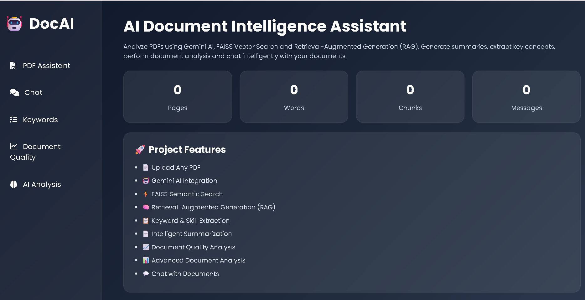
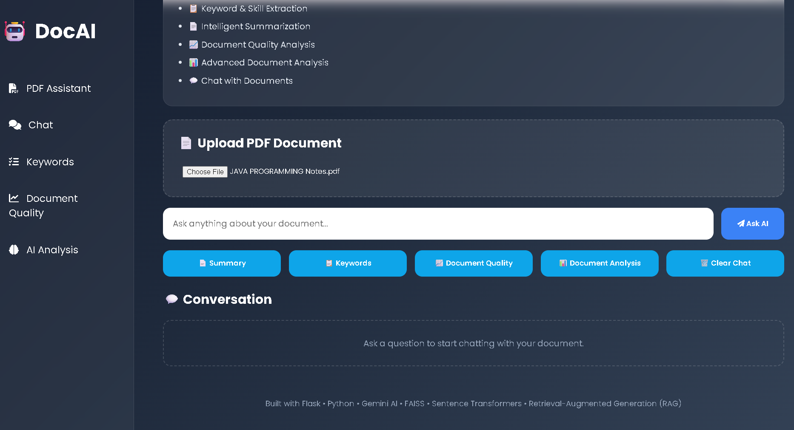
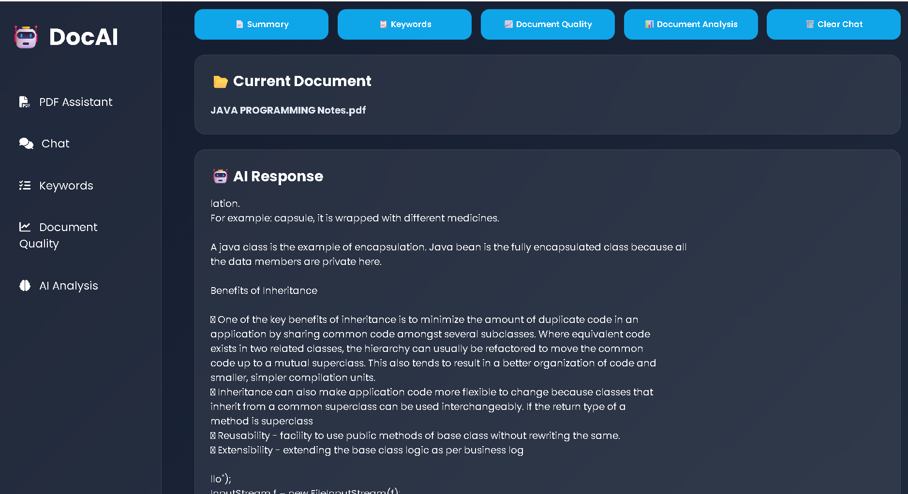
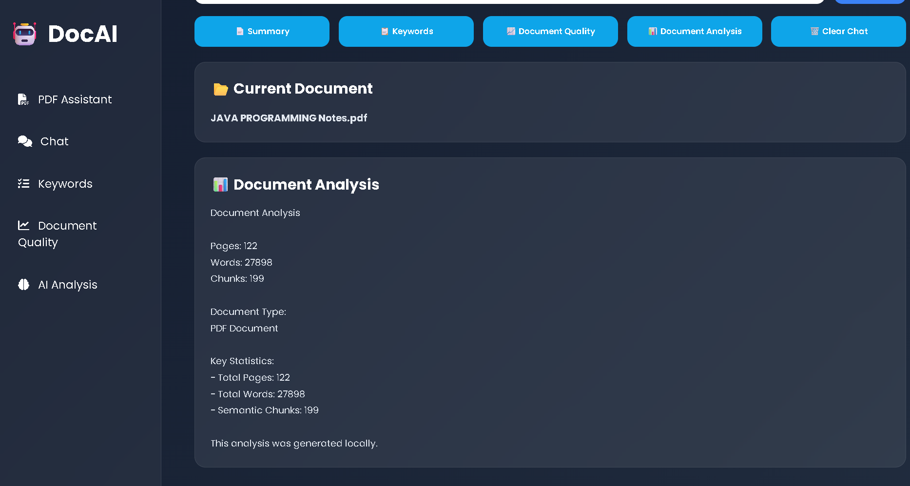

# 🤖 AI-Powered Document Intelligence Assistant

## Overview

AI-Powered Document Intelligence Assistant is a Flask-based web application that enables users to upload PDF documents, interact with them using AI, generate summaries, extract skills and keywords, evaluate document quality, and perform document analysis using Retrieval-Augmented Generation (RAG), FAISS, Sentence Transformers, and Google Gemini AI.

## Features

* 📄 PDF Upload and Processing
* 🤖 AI-Powered Question Answering
* 📄 Document Summarization
* 📋 Skills & Keyword Extraction
* 📈 Document Quality Score
* 📊 Document Analysis
* ⚡ FAISS Vector Search
* 🧠 Retrieval-Augmented Generation (RAG)
* 💬 Interactive Chat Interface

## Tech Stack

* Python
* Flask
* FAISS
* Sentence Transformers
* Google Gemini AI
* HTML
* CSS
* JavaScript

## Screenshots

### Home Page



### PDF Upload



### Ask AI



### Document Analysis



## Installation

```bash
pip install -r requirements.txt
python app.py
```

## Author

**Apoorva Gaonkar**
